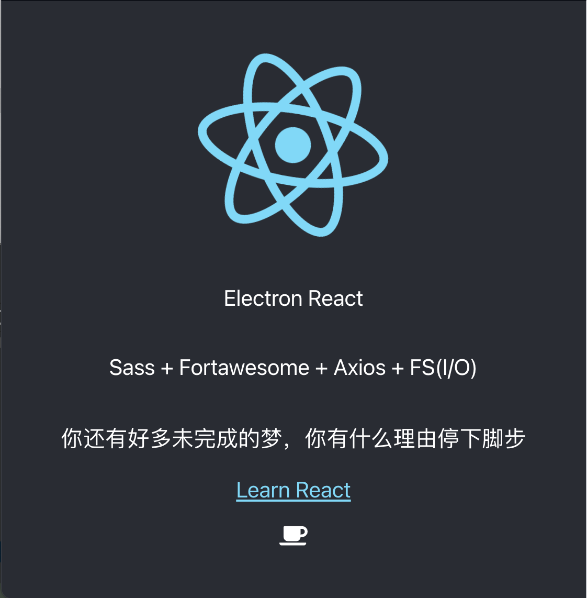

### 启动
```
yarn dev
```

### 创建 React 

```
npx create-react-app my-app
cd my-app
npm start
```

### 安装 electron

```
npm install electron --save-dev
//或者
yarn add electron --save-dev
//安装 electron-is-dev 可判断开发还是生产环境
yarn add electron-is-dev --save-dev
```

### 配置 electron

在项目根目录创建 `main.js`

```js
const { app, BrowserWindow, ipcMain } = require('electron');
const path = require('path');
const isDev = require('electron-is-dev');

function createWindow () {
    const mainWindow = new BrowserWindow({
        width: 800,
        height: 600,
        webPreferences: {
            nodeIntegration: true
        }
    })
    //打开调试工具
    mainWindow.webContents.openDevTools();
    // mainWindow.loadFile('index.html')//加载本地文件
    const urlLocation = isDev ? 'http://localhost:3000' : 'https://www.wxlvip.com';
    mainWindow.loaduRL(urlLocation);
}

// 当 Electron 完成初始化并准备创建浏览器窗口时调用此方法
app.whenReady().then(() => {
    createWindow()
    //MacOS中点击Dock图标时没有已打开的其余应用窗口时,则通常在应用中重建一个窗口
    app.on('activate', function () {
        if (BrowserWindow.getAllWindows().length === 0) createWindow()
    })
})

// 关闭所有窗口时退出应用 (Windows & Linux)
app.on('window-all-closed', function () {
    if (process.platform !== 'darwin') app.quit()
})
```

配置 packjson

```json
{
 "main":"main.js",
 "scripts": {
    "dev": "electron ."
  }
 }
```
解决打开窗口及启动项目两条命令同时执行
```
yarn add concurrently --save-dev
```
解决让打开窗口命令执行完毕后再启动项目，有个先后顺序
```
yarn add wait-on --save-dev
``
设置环境变量，在打开窗口的时候不打开浏览器页面，毕竟react启动项目时会自动打开项目页面
```
yarn add cross-env --save-dev
```
安装好几个小工具后，再配置 packjson

```js
{
 "main":"main.js",
  "scripts": {
    "dev": "concurrently \"wait-on  http://localhost:3000 && electron .\" \"cross-env BROWSER=none npm start\""
  },
 }
```

开启sass，react 框架默认支持 sass ，这里我们用 dart-sass 代替 node-sass 避免版本等兼容问题,安装好后，直接将 .css 文件后缀 改成 .scss 即可
```
yarn add  node-sass@npm:dart-sass
```

安装 [fontawesome-svg](https://github.com/FortAwesome/react-fontawesome#documentation) 图标库

```
yarn add @fortawesome/fontawesome-svg-core --save
yarn add @fortawesome/free-solid-svg-icons --save
yarn add @fortawesome/react-fontawesome --save
```
使用方法
```
import { FontAwesomeIcon } from '@fortawesome/react-fontawesome'
import { faCoffee } from '@fortawesome/free-solid-svg-icons'
import './App.scss';

function App() {
  return (
    <div className="App">
        <FontAwesomeIcon icon={faCoffee} />
    </div>
  );
}

export default App;
```

安装代理
```
yarn add http-proxy-middleware --save-dev
```

文件操作 读取、写入、重命名、删除

/src/utils/file.js


